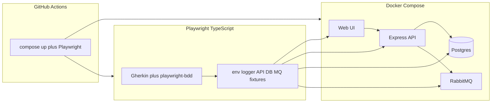

# Playwright + TypeScript test framework

[](https://github.com/evansnicholasa/nevans-playwright-typescript/actions/workflows/ci.yml)

A clone-and-run Playwright framework aimed at hiring conversations. It is not a bag of specs: there is a real system under test (UI, REST API, Postgres, RabbitMQ), a typed harness around it, Gherkin for readable coverage, and CI that publishes HTML and Allure reports.

## What you can prove in ten minutes

1. `docker compose up -d --wait --build`
2. `npm test`
3. Open `playwright-report/index.html` (and optionally generate Allure from `allure-results`)

You should see UI, API, database, and queue scenarios pass against the demo **orders** app.

## Architecture



| Layer | What it is | Why it is here |
| --- | --- | --- |
| `demo-app/` | Express app + static UI | Something real to automate |
| Postgres | `orders` table | Prove writes landed, not only that the UI said they did |
| RabbitMQ | fanout exchange `orders` | Prove a side effect beyond HTTP |
| `src/` | Config, logger, API/DB/MQ clients, page objects | The reusable framework |
| `features/` | Gherkin | Readable coverage for walkthroughs |
| GitHub Actions | Compose + Playwright | The suite is not laptop-only |

## Environments

`TEST_ENV` selects `local`, `ci`, or `staging`. Values are Zod-validated in [`src/config/env.ts`](src/config/env.ts).

| File | Used when |
| --- | --- |
| `.env.local` | Laptop runs against Docker Compose (`TEST_ENV=local`, default) |
| `.env.ci` | GitHub Actions (`TEST_ENV=ci`) |
| `.env.staging` | Gitignored overrides when pointing the harness at another app |

Defaults match Docker Compose published ports (`http://localhost:3000`, local Postgres and RabbitMQ). Secrets never belong in git; `API_TOKEN` is an empty hook until you point the client at an authenticated API.

## How to add a test

1. Add a `.feature` file under `features/`.
2. Reuse or add a step in `src/steps/`.
3. Put locators in `src/ui/`, HTTP in `src/api/`, SQL in `src/db/`, AMQP in `src/mq/`.
4. `npm test` runs `bddgen` then Playwright.

Gherkin should describe intent. Selectors, connection strings, and retry details stay in TypeScript.

## Point this at another app

1. Copy `.env.local` to `.env.staging`.
2. Set `BASE_URL`, `DATABASE_URL`, `RABBITMQ_URL`, and `API_TOKEN` if the API needs a bearer header.
3. Swap or extend page objects and Gherkin for that product's language.
4. Keep the clients. They are URL- and connection-string driven on purpose.

The demo app is a teaching aid, not the framework.

## Reporting

On failure Playwright keeps **trace**, **screenshot**, and **video**. The HTML report is always written. Allure results go to `allure-results/` (generate with `npm run report:allure` if you have Java available for the Allure CLI).

## Local prerequisites

- Docker with Compose v2 (`--wait` needs healthchecks, which this repo defines)
- Node 20+

```bash
docker compose up -d --wait --build
npm install
npx playwright install chromium
npm test
```

## License

MIT
